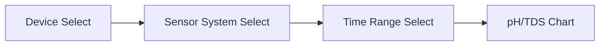

# Admin Analytics Implementation Plan

## Part 1: Dashboard Enhancement - pH/TDS Chart Filters

Update the `[resources/js/components/ph-tds-chart.tsx](resources/js/components/ph-tds-chart.tsx)` and `[app/Http/Controllers/Dashboard/DashboardController.php](app/Http/Controllers/Dashboard/DashboardController.php)` to add:

- **Device Dropdown**: List all non-archived devices
- **Sensor System Dropdown**: Filter by system type (dirty_water, clean_water, hydroponics_water) based on selected device
- Fetch real sensor readings from `sensor_readings` table instead of hardcoded data

---

## Part 2: Admin Analytics Page - Meaningful Data

Update `[resources/js/pages/analytics/index.tsx](resources/js/pages/analytics/index.tsx)` and `[app/Http/Controllers/analytics/AnalyticsController.php](app/Http/Controllers/analytics/AnalyticsController.php)` with four main tabs:

### Tab 1: Users and Devices Overview

| Metric | Source Table |

|--------|--------------|

| Total users (active/inactive/archived) | `users` |

| Total devices (online/offline) | `devices` |

| Device status distribution | `devices.status` |

| Users without devices | `device_users` join |

### Tab 2: Crops and Harvest Analytics

| Metric | Source Table |

|--------|--------------|

| Total hydroponic setups by status | `hydroponic_setup.status` |

| Growth stage distribution | `hydroponic_setup.growth_stage` |

| Crop Type Distribution |

| Most Grown Crop Type |

|Total Harvest This Month|

| Total Harvest This Year|

| Health status distribution | `hydroponic_setup.health_status` |

| Harvest rate (harvested vs total) | `hydroponic_setup.harvest_status` |

### Tab 3: Yield Analytics

| Metric | Source Table |

|--------|--------------|

| Total yield weight (all users) | `hydroponic_yields.total_weight` |

| Grade distribution (selling/consumption/disposal) | `hydroponic_yield_grades` |

| Average yield per setup | calculated |

| Top yielding crops | `hydroponic_yields` + `hydroponic_setup` |

### Tab 4: Water Treatment Analytics

| Metric | Source Table |

|--------|--------------|

| Total treatment cycles | `treatment_reports` |

| Success/failure rate | `treatment_reports.final_status` |

| Average treatment duration | `treatment_reports.start_time/end_time` |

| Stage performance breakdown | `treatment_stages` |

---

## Files to Create/Modify

| File | Action |

|------|--------|

| `app/Services/AdminAnalyticsService.php` | Create - Analytics calculations |

| `app/Http/Controllers/analytics/AnalyticsController.php` | Modify - Add data endpoints |

| `app/Http/Controllers/Dashboard/DashboardController.php` | Modify - Add device/sensor data |

| `resources/js/pages/analytics/index.tsx` | Modify - Build analytics UI |

| `resources/js/components/ph-tds-chart.tsx` | Modify - Add filter dropdowns |

| `resources/js/types/analytics.ts` | Create - TypeScript interfaces |

| `routes/web.php` | Modify - Add any new routes |
